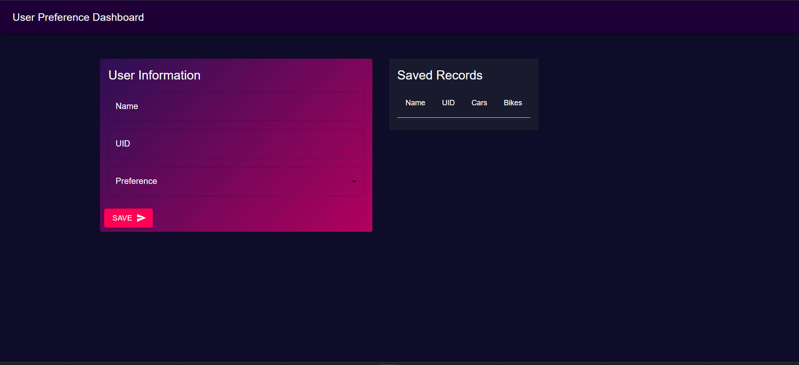

# Material-UI User Preference Dashboard

A modern React application built with Material-UI that allows users to record and display their vehicle preferences (Cars or Bikes) in an elegant, responsive dashboard.

## 🚀 Features

- **User Input Form**: Collect user information including name, UID, and vehicle preference
- **Real-time Data Display**: View saved records in a responsive table format
- **Material-UI Components**: Beautiful, accessible UI components with dark theme
- **Interactive Animations**: Smooth hover effects and fade-in animations
- **Responsive Design**: Works seamlessly on desktop and mobile devices
- **Success Notifications**: Toast notifications for successful data submissions

## 🛠️ Technologies Used

- **React 19.2.0** - Modern JavaScript library for building user interfaces
- **Material-UI (MUI) 7.3.7** - React components implementing Google's Material Design
- **Vite 7.2.4** - Fast build tool and development server
- **Bootstrap 5.3.8** - CSS framework for additional styling
- **Emotion** - CSS-in-JS library for styling MUI components

## 📦 Installation

1. Clone the repository:
```bash
git clone <repository-url>
cd material-ui-app
```

2. Install dependencies:
```bash
npm install
```

3. Start the development server:
```bash
npm run dev
```

4. Open your browser and navigate to `http://localhost:5173`

## 🏗️ Build & Deployment

### Clone
```bash
git clone https://github.com/avvvvviiiiiiiiii/FSD_23BAI70305.git
```
### Run the code
```bash
npm run dev
```
## Output



## 🎨 UI Components Used

- **AppBar & Toolbar**: Navigation header
- **Card, CardContent, CardActions**: Form and data display containers
- **TextField**: Input fields for user data
- **Button**: Interactive submit button with icons
- **Table**: Data display with custom styling
- **Grid**: Responsive layout system
- **Snackbar & Alert**: Success notifications
- **Fade**: Animation component for smooth transitions

## 🎯 Key Features Explained

### User Input Form
- Name field (text input)
- UID field (text input)
- Preference dropdown (Car/Bike selection)
- Submit button with send icon

### Data Display Table
- Shows all saved user records
- Columns: Name, UID, Cars, Bikes
- Icons display based on vehicle preference
- Responsive design for mobile viewing

### Visual Design
- Dark gradient background
- Purple/pink color scheme
- Hover effects on cards
- Smooth animations and transitions

## 📱 Responsive Design

The application is fully responsive and works on:
- Desktop computers
- Tablets
- Mobile phones

The grid layout automatically adjusts based on screen size, ensuring optimal user experience across all devices.

## 🤝 Contributing

1. Fork the repository
2. Create your feature branch (`git checkout -b feature/AmazingFeature`)
3. Commit your changes (`git commit -m 'Add some AmazingFeature'`)
4. Push to the branch (`git push origin feature/AmazingFeature`)
5. Open a Pull Request

## 📄 License

This project is licensed under the MIT License - see the [LICENSE](LICENSE) file for details.

## 🙏 Acknowledgments

- [Material-UI](https://mui.com/) for the amazing component library
- [React](https://reactjs.org/) for the powerful framework
- [Vite](https://vitejs.dev/) for the blazing fast build tool
