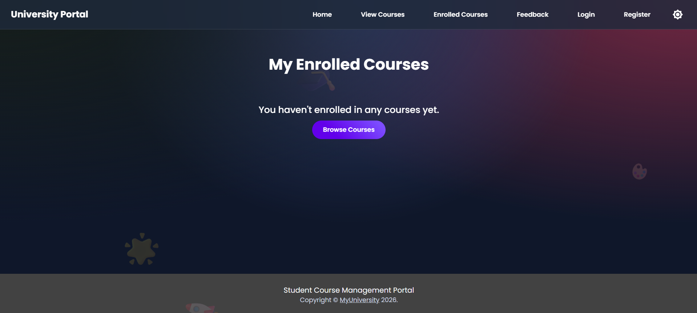
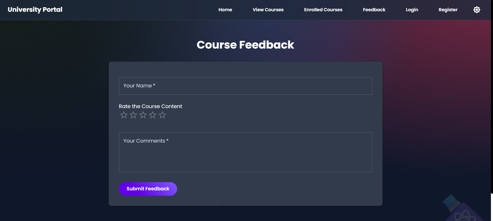
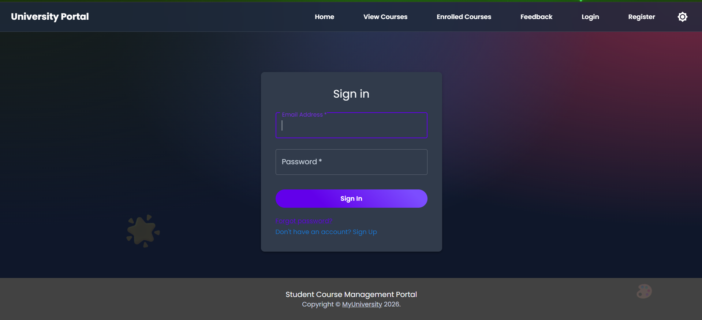
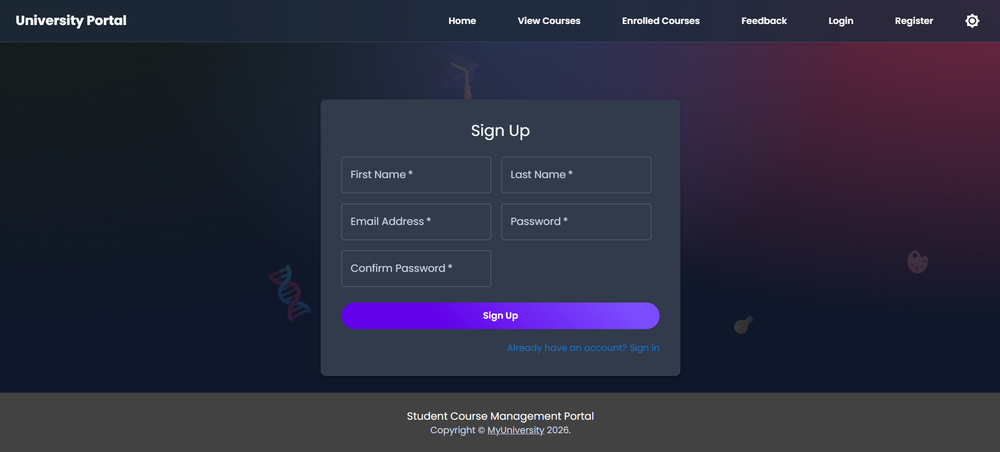

# 🎓 Student Course Management Portal (Frontend Only)

A modern, responsive **Student Course Management Portal** built using **React JS**, **Bootstrap**, **Material UI**, and **Framer Motion**.  
This project simulates a university portal where students can explore courses, enroll or de-enroll, submit feedback, and interact with authentication interfaces (UI only).

---

## 📌 Project Overview

The Student Course Management Portal is a **single-page application (SPA)** designed to demonstrate modern frontend development practices.  
It focuses on **clean UI/UX**, **component-based architecture**, **state management**, and **smooth animations**, without using any backend or database.

---

## ✨ Features

### 🏠 Home Page
- University overview and highlights  
- Academic excellence, modern learning, and career growth sections  
- Smooth page animations  

### 📚 View Courses
- Displays available university courses  
- Course details: name, duration, and description  
- Attractive card-based layout with hover effects  
- Prevents duplicate enrollment  

### ✅ Enrolled Courses
- Shows courses enrolled by the student  
- Option to de-enroll from courses  
- Real-time updates using global state  
- Animated transitions  

### 📝 Feedback
- Feedback form using Material UI components  

### 🔐 Login (UI Only)
- Email/phone number and password fields  

### 🧾 Register (UI Only)
- Registration form with validation-ready fields  

### 🌗 Dark / Light Mode
- Toggle between dark and light themes using Material UI theming  

---

## 🛠️ Technologies Used

- React JS  
- JavaScript (ES6)  
- React Router DOM  
- Bootstrap  
- Material UI (MUI)  
- Framer Motion  
- CSS  

---

## 🧠 Architecture & State Management

- Component-based architecture  
- React Context API for global state management  
- Centralized course enrollment logic  
- Seamless data sharing between pages  

---

## 📂 Project Structure

```
src/
│── components/
│   └── Navbar.js
│
│── context/
│   └── CourseContext.js
│
│── pages/
│   ├── Home.js
│   ├── ViewCourses.js
│   ├── EnrolledCourses.js
│   ├── Feedback.js
│   ├── Login.js
│   └── Register.js
│
│── data.js
│── theme.js
│── App.js
│── index.js
│── index.css
```

---

## 🚀 Getting Started

### Installation
```bash

git clone https://github.com/avvvvviiiiiiiiii/FSD_23BAI70305.git
npm install
```

### Run
```bash
npm start
```

---
## Outputs








## ⚠️ Limitations

- No backend integration  
- Authentication is UI-only  
- Data resets on refresh  

---

## 🔮 Future Enhancements

- Backend integration  
- Authentication using JWT  
- Persistent storage  
- Admin dashboard  

---

## 📄 License

Educational purpose only.
