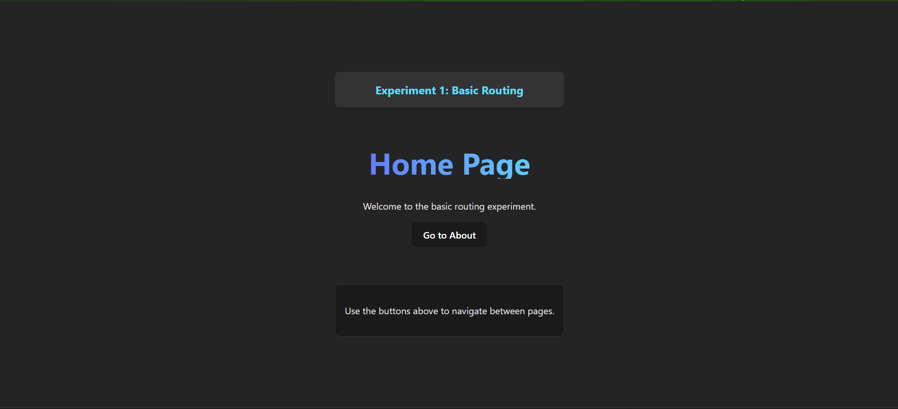
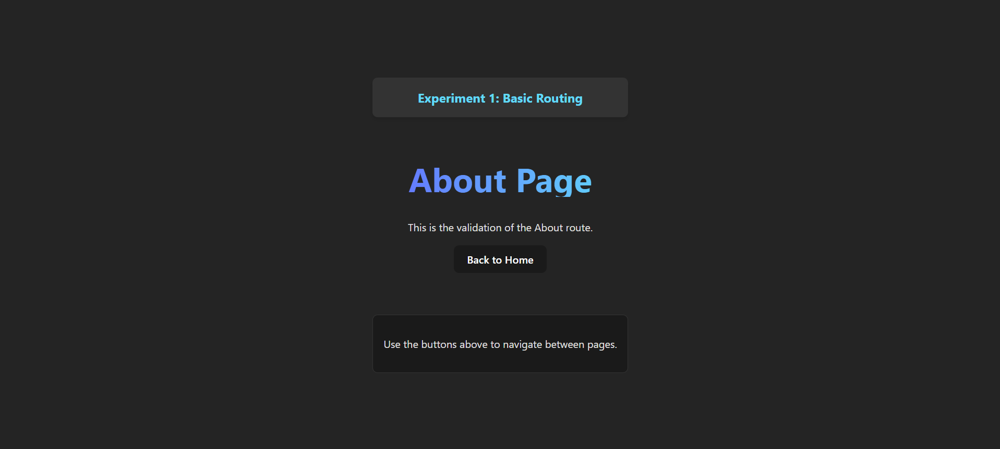

# Experiment 1: Basic Client-Side Routing Using React Router

## Aim
To implement basic client-side routing in a Single Page Application (SPA) using React Router.

## Software Requirements
*   Node.js
*   React
*   React Router DOM
*   Web Browser

## Theory
Routing in a Single Page Application allows navigation between different views without reloading the page. React Router is a popular library used to handle client-side routing in React applications using components such as `BrowserRouter`, `Routes`, and `Route`.

## Procedure
1.  Create a React application.
2.  Install `react-router-dom` package.
3.  Wrap the application with `BrowserRouter`.
4.  Define routes using `Routes` and `Route` components.
5.  Navigate between pages without page reload.

## How to Run

git clone https://github.com/prathamsinghal000/FSD_23BAI70557

1.  Navigate to the project directory:
    ```bash
    cd basic_routing_1
    ```
2.  Install dependencies:
    ```bash
    npm install
    ```
3.  Start the development server:
    ```bash
    npm run dev
    ```


