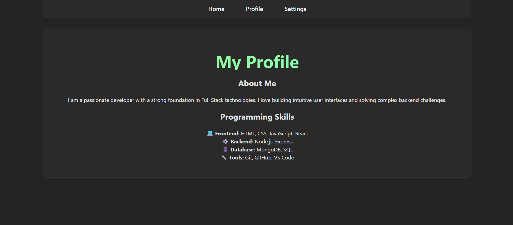
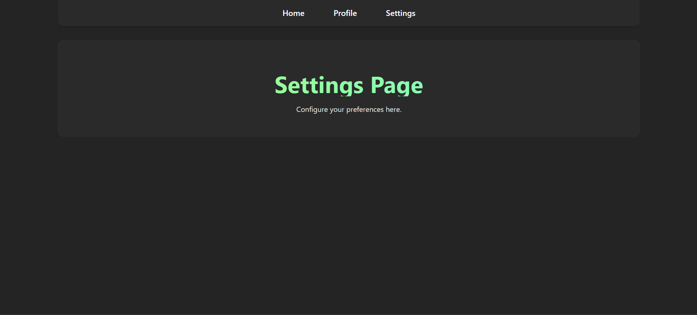

# Experiment 2: Navigation Using Link Component

## Aim
To implement navigation links in a Single Page Application (SPA) using React Router `Link` component.

## Software Requirements
*   Node.js
*   React
*   React Router DOM
*   Web Browser

## Theory
The `Link` component in `react-router-dom` enables accessible navigation around your application. Unlike standard anchor tags (`<a>`), `Link` does not reload the page, preserving the application state and providing a smoother user experience typical of SPAs.

## Procedure
1.  Import `Link` from `react-router-dom`.
2.  Create navigation links using the `<Link>` component.
3.  Enable smooth navigation between different route components.

## Implementation Details
This project demonstrates a navigation bar that stays persistent at the top of the page (sticky navbar) while the content below changes based on the selected route.

git clone https://github.com/prathamsinghal000/FSD_23BAI70557

## How to Run
1.  Navigate to the project directory:
    ```bash
    cd link_compo_2
    ```
2.  Install dependencies:
    ```bash
    npm install
    ```
3.  Start the development server:
    ```bash
    npm run dev
    ```



