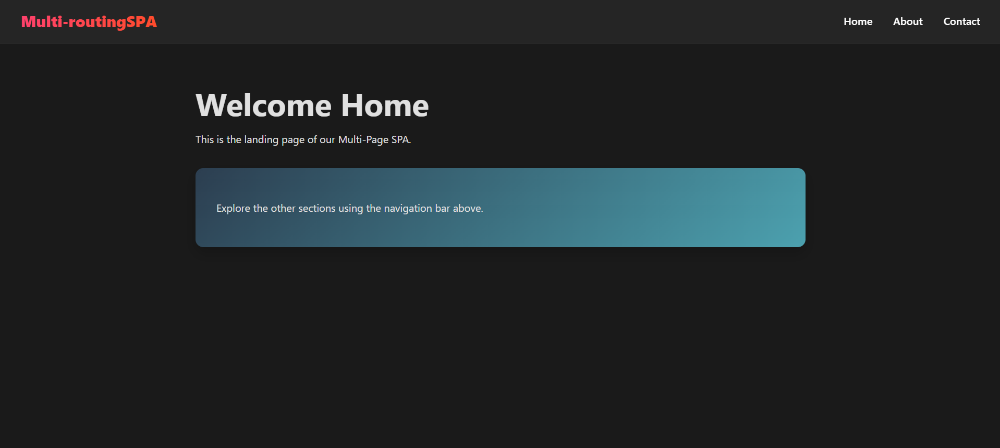
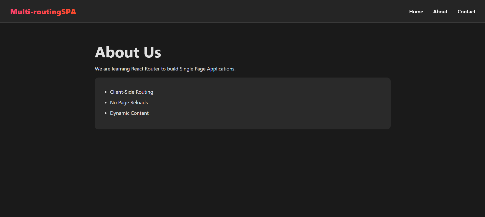

# Experiment 3: Multi-Page SPA Using Routing

## Aim
To create a complete Multi-Page Single Page Application (SPA) using client-side routing.

## Software Requirements
*   Node.js
*   React
*   React Router DOM
*   Web Browser

## Theory
A Multi-Page SPA simulates the experience of a traditional multi-page website but loads content dynamically. By organizing the application into distinct "Page" components (e.g., Home, About, Contact) and mapping them to specific URL paths, we can create complex application structures that are fast and responsive.

## Procedure
1.  Create multiple components representing different pages (Home, About, Contact).
2.  Map each component to a specific route using `Routes` and `Route`.
3.  Implement a navigation bar to allow users to switch between these views.
4.  Test navigation to ensure the correct component renders for each URL.

## Implementation Details
*   **Modular Architecture**: Components are separated into a `components/` folder.
*   **Styling**: Uses modern CSS for a dark-themed, responsive design.
*   **Navigation**: Includes a fully functional navbar that links to all pages.

git clone https://github.com/prathamsinghal000/FSD_23BAI70557

## How to Run
1.  Navigate to the project directory:
    ```bash
    cd multi-page_routing_3
    ```
2.  Install dependencies:
    ```bash
    npm install
    ```
3.  Start the development server:
    ```bash
    npm run dev
    ```



